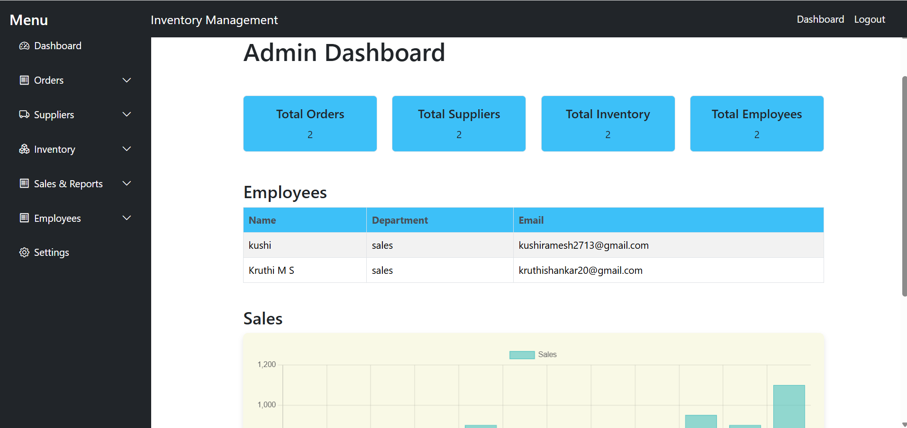
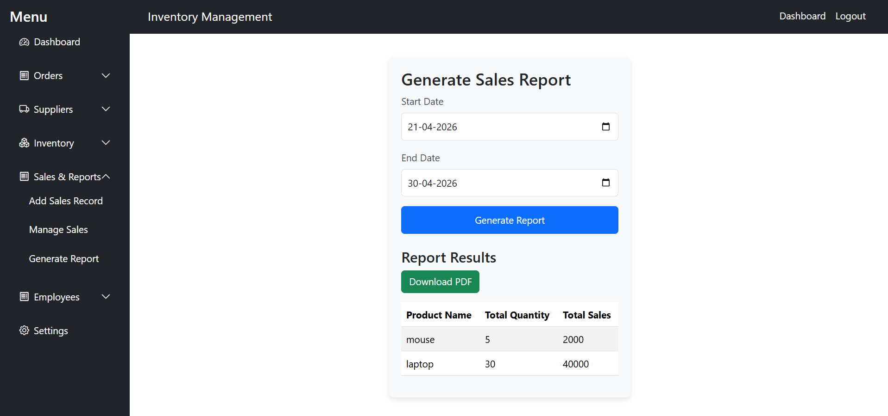
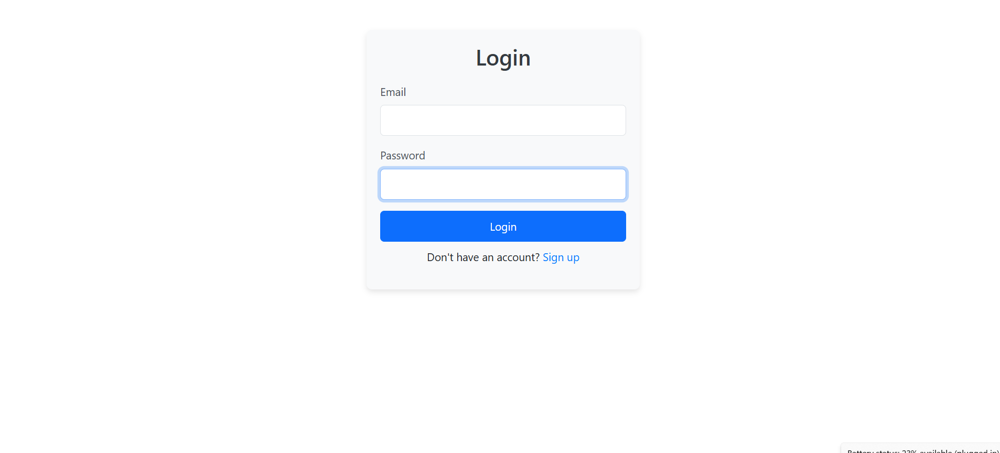

# 📦 Inventory Management System (MERN)

A full-stack **Inventory Management System** built using the **MERN Stack (MongoDB, Express, React, Node.js)**. This application allows users to efficiently manage products, track stock levels, and perform CRUD operations through a clean and user-friendly interface.

---

## 🚀 Features

* 🔐 User Authentication (Login / Signup)
* 📦 Add, Update, Delete Products
* 📊 Real-time Stock Management
* 🔍 Search and Filter Products
* 📁 Category & Supplier Management
* 🧾 Product History Tracking
* 💻 Responsive User Interface

---

## 🛠️ Tech Stack

* **Frontend:** React (Vite)
* **Backend:** Node.js, Express.js
* **Database:** MongoDB
* **API Testing:** Postman

---

## 📸 Screenshots

### 🏠 Dashboard



### 📦 Products Page




### 🔐 Login Page



---

## ⚙️ Installation & Setup

### 1️⃣ Clone the Repository

```bash
git clone https://github.com/YOUR_USERNAME/inventory-management-system.git
cd inventory-management-system
```

---

### 2️⃣ Setup Backend

```bash
cd backend
npm install
```

Create `.env` file:

```env
MONGODB_URI=your_mongodb_connection
PORT=5000
SECRET_KEY=your_secret_key
NODE_ENV=development
ORIGIN=http://localhost:5173
```

Run backend:

```bash
npm start
```

---

### 3️⃣ Setup Frontend

```bash
cd frontend
npm install
npm run dev
```

Open in browser:

```
http://localhost:5173
```

---

## 📡 API Endpoints

| Method | Endpoint             | Description      |
| ------ | -------------------- | ---------------- |
| POST   | /api/v1/users/signup | Register user    |
| POST   | /api/v1/users/login  | Login user       |
| GET    | /api/v1/products     | Get all products |
| POST   | /api/v1/products     | Add product      |
| PUT    | /api/v1/products/:id | Update product   |
| DELETE | /api/v1/products/:id | Delete product   |

---

## 📁 Project Structure

```
merninventory/
 ├── backend/
 ├── frontend/
 └── screenshots/
```

---

## 💡 Future Enhancements

* 📊 Analytics Dashboard (Charts)
* 🔔 Low Stock Alerts
* 📤 Export Reports (PDF/Excel)
* 👥 Role-based Access Control

---

## 👨‍💻 Author

**Kruthi Shankar**
GitHub: https://github.com/YOUR_USERNAME

---

## ⭐ Acknowledgement

This project was built as part of learning full-stack development using the MERN stack.

---

## 📌 Note

Make sure MongoDB is properly connected and running before starting the backend server.

---
